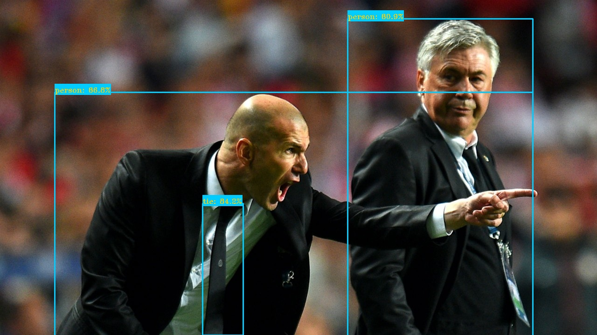

## Co-DETR  TensorRT 模型端到端加速推理的C++实现

徐静

### 0. 环境配置说明

+ Ubuntu16.04下安装mmdetection, mmdeploy, 其依赖mmcv和mmengine

```shell
# mmdetection==3.3.0
git clone -b 3.3.0 https://github.com/open-mmlab/mmdetection
pip install -v -e .

# mmcv
pip install mmcv==2.0.0

# mmdeploy
# https://github.com/TommyZihao/MMDeploy_Tutorials  
git clone -b 1.3.1 https://github.com/open-mmlab/mmdeploy --recursive
# 编译并安装 MMDeploy（耗时大约十分钟）
python tools/scripts/build_ubuntu_x64_ort.py
```

+ windows TensorRT的环境
  + TensorRT 8.5
  + cuda 11.0, cudnn
  + vs2017
  + cmake version 3.22.1
  + opencv


### 1.Co-DETR 转ONNX

1.修改模型配置文件，关闭测试过程中的soft-nms(后面用EfficientNMS Plugin代替)

```python
# mmdetection/projects/CO-DETR/configs/codino/co_dino_5scale_swin_l_16xb1_16e_o365tococo.py
#mmdetection/projects/CO-DETR/configs/codino/co_dino_5scale_r50_lsj_8xb2_1x_coco.py

    test_cfg=[
        # # Deferent from the DINO, we use the NMS.
        dict(
            max_per_img=300,
            # NMS can improve the mAP by 0.2.
            # nms=dict(type='soft_nms', iou_threshold=0.8)),  # 关掉test过程中的soft nms
        ),
```

2.修改mmdeploy中关于onnx的导出配置

```python
# mmdeploy/configs/_base_/onnx_config.py
onnx_config = dict(
    type='onnx',
    export_params=True,
    keep_initializers_as_inputs=False,
    opset_version=11,  # opset 版本
    save_file='end2end.onnx',  #转出onnx的保存名字
    input_names=['input'],  # input的名字
    output_names=['output'],  # output的名字
    input_shape=None,
    optimize=True)
# mmdeploy/configs/mmdet/_base_/base_static.py

_base_ = ['../../_base_/onnx_config.py']

onnx_config = dict(output_names=['dets', 'labels'], input_shape=[640,640])  # static input的大小设置为640x640
codebase_config = dict(
    type='mmdet',
    task='ObjectDetection',
    model_type='end2end',
    post_processing=dict(
        score_threshold=0.05,
        confidence_threshold=0.005,  # for YOLOv3
        iou_threshold=0.5,
        max_output_boxes_per_class=200,
        pre_top_k=5000,
        keep_top_k=100,
        background_label_id=-1,
    ))

# co-dino使用了多尺度训练，这里我们将test input的尺度设为640x640,减少计算量
```

3.mmdeploy转onnx

```shell
python mmdeploy/tools/deploy.py \
        mmdeploy/configs/mmdet/detection/detection_onnxruntime_static.py \
        mmdetection/projects/CO-DETR/configs/codino/co_dino_5scale_swin_l_16xb1_16e_o365tococo.py \
        mmdetection/checkpoints/co_dino_5scale_swin_large_16e_o365tococo-614254c9.pth \
        mmdetection/demo/demo.jpg \
        --work-dir mmdetection/checkpoints \
        --device cpu
# 这个过程生成了end2end.onnx的，但是onnxruntime的时候或报错，报错的原因是grid_sampler算子onnxruntime和tensorrt均不支持，稍后会编译tensorrt plugin解决该伪问题
```

4.对onnx进行onnxsim和 fold constants

```shell
polygraphy surgeon sanitize end2end.onnx --fold-constants -o end2end_folded.onnx
python -m onnxsim end2end_folded.onnx end2end_folded_sim.onnx
```


### 2. Windows 下单独编译mmdeploy中仅涉及Co-DETR的TensorRT Plugin

```CMakeLists
cmake_minimum_required(VERSION 2.6)

project(mmdeploy_plugins)

add_definitions(-std=c++11)
add_definitions(-DAPI_EXPORTS)
option(CUDA_USE_STATIC_CUDA_RUNTIME OFF)
set(CMAKE_CXX_STANDARD 11)
set(CMAKE_BUILD_TYPE Release)
set(CMAKE_CXX_FLAGS "${CMAKE_CXX_FLAGS}  /O2")
add_compile_definitions(WIN32_LEAN_AND_MEAN NOMINMAX)

find_package(CUDA REQUIRED)

#if(WIN32)
#enable_language(CUDA)
#endif(WIN32)

# cuda
set(cuda_inc "C:/Program Files/NVIDIA GPU Computing Toolkit/CUDA/v11.0/include")
set(cuda_lib "C:/Program Files/NVIDIA GPU Computing Toolkit/CUDA/v11.0/lib/x64")
include_directories(${cuda_inc})
link_directories(${cuda_lib})
#cub
set(CUB_ROOT_DIR "C:/Program Files/NVIDIA GPU Computing Toolkit/CUDA/v11.0/include/cub")
include_directories(${CUB_ROOT_DIR})
# tensorrt
set(tensorrt_inc "D:/trt_install/TensorRT-8.5.1.7/include")
set(tensorrt_lib "D:/trt_install/TensorRT-8.5.1.7/lib")
include_directories(${tensorrt_inc})
link_directories(${tensorrt_lib})
# opencv
#include_directories("${PROJECT_SOURCE_DIR}/third_party/CV460_64/include")
#set(opencv_lib "${PROJECT_SOURCE_DIR}/third_party/CV460_64/lib/opencv_world460.lib")

# common files，来源于mmdeploy
include_directories(common)

file(GLOB grid_sampler_src ${PROJECT_SOURCE_DIR}/grid_sampler/*.cpp ${PROJECT_SOURCE_DIR}/grid_sampler/*.cu)
cuda_add_library(trtgrid_sampler SHARED ${grid_sampler_src})
#cuda_add_library(trtgrid_sampler STATIC ${grid_sampler_src})
target_link_libraries(trtgrid_sampler nvinfer cudart)


file(GLOB topk_src ${PROJECT_SOURCE_DIR}/gather_topk/*.cpp ${PROJECT_SOURCE_DIR}/gather_topk/*.cu)
cuda_add_library(trtgather_topk SHARED ${topk_src})
#cuda_add_library(trtgather_topk STATIC ${topk_src})
target_link_libraries(trtgather_topk nvinfer cudart)


if(UNIX)
    add_definitions(-O2 -pthread)
endif(UNIX)
```


1. 打开vs studio 2017的终端`x64 Native Tools Command ...`，cd到项目的目录进行编译


2.windows下编译TensorRT Plugin

```bash
mkdir build && cd build
cmake -G ”NMake Makefiles“ ..
nmake
```

在build文件夹下生成了`trtgrid_sampler.dll`和`trtgather_topk.dll`,下面我们会使用`trtgrid_sampler.dll`的plugin 。

### 3.Co-DETR  ONNX Graph修改和编辑

原始导出的不包含nms的graph


执行编辑onnx graph的脚本：

```shell
python co_detr_add_nms.py
```

模型结构变为：


### 4.Windows下序列化Co-DETR TensorRT engine

```shell
trtexec --onnx=end2end_foled_sim_nms.onnx --saveEngine=test_1.plan --workspace=60000 --verbose --plugins=./trtgrid_sampler.dll
```


### 5.mmdetection中Co-DETR模型前处理实现的分析和C++重写

mmdetection 3.3.0 co-dino的前处理：

+ opencv读入BGR图像

+ 等比例缩放，长边缩放到640，缩放方法bilinear

+ normalize: 

          mean=[123.675, 116.28, 103.53],  # RGB
          std=[58.395, 57.12, 57.375],  #RGB

+ BGR2RGB

+ 短边右下角填充为0

C++实现如下：

```c++
//mmdetection3.3.0 co-detr前处理
void codetr::preprocess(cv::Mat &img, float data[]) {
	int w, h, x, y;
	float r_w = INPUT_W / (img.cols*1.0);
	float r_h = INPUT_H / (img.rows*1.0);
	if (r_h > r_w) {
		w = INPUT_W;
		h = r_w * img.rows;
	}
	else {
		w = r_h * img.cols;
		h = INPUT_H;
	}
	cv::Mat re(h, w, CV_8UC3);
	cv::resize(img, re, re.size(), 0, 0, cv::INTER_LINEAR);
	cv::Mat out(INPUT_H, INPUT_W, CV_8UC3, cv::Scalar(103, 116, 123));  //(0,0,0)像素填充
	re.copyTo(out(cv::Rect(0, 0, re.cols, re.rows)));  //右下角

	int i = 0;
	for (int row = 0; row < INPUT_H; ++row) {
		uchar* uc_pixel = out.data + row * out.step;
		for (int col = 0; col < INPUT_W; ++col) {
			data[i] = ((float)uc_pixel[2] - 123.675)/58.395;  //R
			data[i + INPUT_H * INPUT_W] = ((float)uc_pixel[1] - 116.28) / 57.12;  //G
			data[i + 2 * INPUT_H * INPUT_W] = ((float)uc_pixel[0] - 103.53)/ 57.375;  //B

			uc_pixel += 3;
			++i;
		}
	}
}
```


### 6.Co-DETR TensorRT C++实现和测试

注意C++加载自己定义的Plugin

```c++
bool didInitPlugins = initLibNvInferPlugins(nullptr, "");
void* handle_grid_sampler = LoadLibrary(L"trtgrid_sampler.dll");
```

TensorRT C++的推理Demo:

| bus.jpg                   | zidane.jpg              |
| ------------------------- | ----------------------- |
|  |  |

### 7. Linux如何编译该程序

+ 我提供了在Linux下编译Co-DETR进行端到端推理的代码，请参考`linux_cc/`,其中`plugin`为grid_sampler plugin的编译， `co_detr`为Co-DETR的TensorRT调用。

> [!NOTE]\
>
> + Co-DETR TensorRT的实现，坑确实比较多，参考的网络资源基本没有
> + 我们将soft-nms算子删除，替换为TensorRT EfficientNMS Plugin
> + 我们在windows下编译了TensorRT Plugin grid_sampler

最终成功实现了Co-DETR的端到端的TensorRT 模型推理异构计算加速推理！